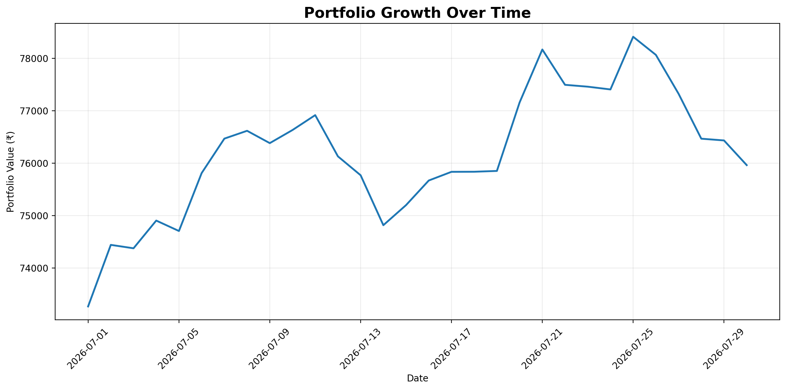
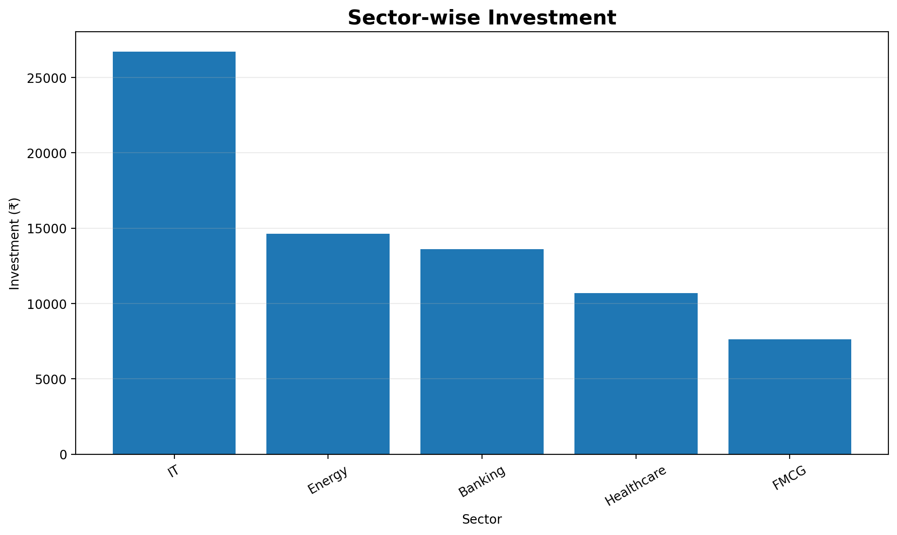
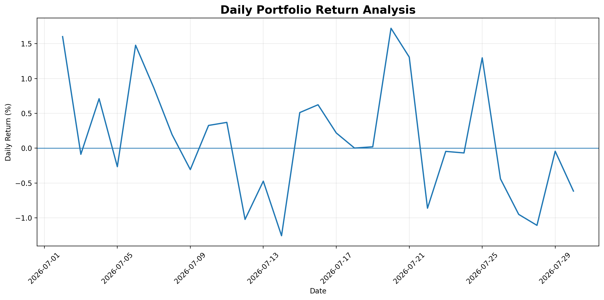
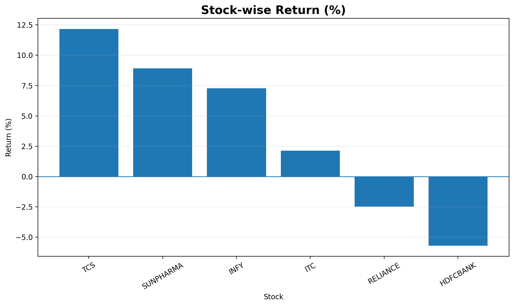

# 📈 Portfolio Intelligence Analyzer

```{=html}
<p align="center">
```
`<strong>`{=html}An interactive stock portfolio analytics dashboard
built with Python, Pandas, NumPy, Plotly and
Streamlit.`</strong>`{=html}`<br>`{=html} Analyze portfolio performance,
allocation, risk, drawdown, volatility and moving-average momentum
signals from CSV data.
```{=html}
</p>
```
```{=html}
<p align="center">
```
`<a href="https://sv-portfolio-analyzer.streamlit.app/">`{=html}🚀 Live
Demo`</a>`{=html}  • 
`<a href="https://github.com/Shreya934-bot/Streamlit-Analytics-Projects">`{=html}📦
GitHub Repository`</a>`{=html}
```{=html}
</p>
```

------------------------------------------------------------------------

## ✨ Overview

**Portfolio Intelligence Analyzer** is a practical data analytics
project developed as **Day 28 of a Python Internship Journey**.

The project transforms historical stock-price data into an interactive
portfolio intelligence dashboard. It combines portfolio valuation,
stock-level performance, sector allocation, risk analytics, drawdown
analysis and moving-average momentum signals in one interface.

The application supports both:

-   **Built-in CSV analysis** using the included `stock_prices.csv`
-   **Custom CSV uploads** through the Streamlit sidebar

The dashboard is designed to move beyond simple tables by turning raw
price data into decision-oriented metrics and interactive
visualizations.

> **Important:** This is an educational analytics project. It does not
> fetch live market prices, execute trades, or provide financial advice.

------------------------------------------------------------------------

## 🚀 Live Application

### [Launch Portfolio Intelligence Analyzer](https://sv-portfolio-analyzer.streamlit.app/)

The deployed Streamlit application includes:

-   Portfolio KPI cards
-   Interactive date, stock and sector filters
-   Stock-level holdings analysis
-   Sector allocation
-   Daily return analysis
-   Maximum drawdown
-   Annualized volatility
-   Sharpe ratio
-   Moving-average momentum signals
-   Interactive Plotly charts
-   CSV report downloads
-   Custom portfolio CSV upload

------------------------------------------------------------------------

## 🎯 Project Goals

This project was built to demonstrate how Python can be used to turn
structured financial data into an interactive analytics product.

### Core objectives

1.  Load and validate historical stock data from CSV.
2.  Calculate investment and current portfolio value.
3.  Measure stock-level and portfolio-level returns.
4.  Identify strongest and weakest holdings.
5.  Analyze sector concentration.
6.  Measure portfolio risk and volatility.
7.  Visualize portfolio growth and drawdowns.
8.  Generate configurable moving-average signals.
9.  Allow users to interactively filter and explore the dataset.
10. Export analysis results as reusable CSV reports.

------------------------------------------------------------------------

# 🧩 Key Features

## 1. 📥 Flexible Portfolio Input

The dashboard accepts a CSV containing:

``` text
Date,Ticker,Sector,Close,Quantity
```

The application validates the required columns, converts dates and
numeric fields, removes invalid records and normalizes ticker symbols
before analysis.

It can either:

-   Load the included `stock_prices.csv`
-   Use a CSV uploaded by the user

------------------------------------------------------------------------

## 2. 💰 Portfolio Valuation

For every holding, the application calculates:

  Metric          Formula
  --------------- --------------------------------------
  Investment      `Buy Price × Quantity`
  Current Value   `Current Price × Quantity`
  Profit / Loss   `Current Value − Investment`
  Return %        `(Profit / Loss ÷ Investment) × 100`

The dashboard then aggregates these values into portfolio-level KPIs.

------------------------------------------------------------------------

## 3. 🏆 Performance Ranking

The analyzer automatically identifies:

-   Best-performing holding
-   Worst-performing holding
-   Overall portfolio return
-   Profit / Loss
-   Largest portfolio allocation

This makes it easy to identify which holdings are driving portfolio
performance.

------------------------------------------------------------------------

## 4. 📊 Portfolio Trajectory

The **Overview** section provides an interactive portfolio-value time
series.

It helps answer:

> How did the portfolio value change throughout the selected analysis
> window?

The Plotly chart supports interactive hover inspection and automatically
responds to the dashboard filters.

------------------------------------------------------------------------

## 5. 🏭 Sector Allocation

The dashboard aggregates investments by sector and presents the initial
investment allocation visually.

This helps identify:

-   Largest sector exposure
-   Concentration across sectors
-   Relative capital allocation

------------------------------------------------------------------------

## 6. 📋 Holdings Intelligence

The **Holdings** tab provides a detailed table containing:

-   Ticker
-   Sector
-   Quantity
-   Buy Price
-   Current Price
-   Investment
-   Current Value
-   Profit / Loss
-   Return %
-   Allocation %

It also includes a concentration chart showing the largest portfolio
allocations.

------------------------------------------------------------------------

## 7. 🛡️ Risk & Returns Analytics

The dashboard calculates several portfolio risk indicators.

### Sharpe Ratio

``` text
Sharpe Ratio =
(Annualized Portfolio Return − Risk-Free Rate)
÷ Annualized Volatility
```

The application annualizes the mean daily return using 252 trading
sessions and compares it against the user-selected risk-free rate.

### Maximum Drawdown

The application tracks the running portfolio peak and measures the
percentage decline from that peak.

``` text
Drawdown % =
(Current Portfolio Value ÷ Running Peak − 1) × 100
```

### Annualized Volatility

Daily return volatility is annualized using:

``` text
Daily Standard Deviation × √252
```

### Daily Win Rate

``` text
Win Rate =
Positive Return Days ÷ Total Return Days × 100
```

The Risk & Returns section visualizes:

-   Daily return profile
-   Portfolio drawdown
-   Rolling 10-day annualized volatility

------------------------------------------------------------------------

## 8. 📈 Momentum Analysis

The **Momentum** section provides a configurable moving-average
analysis.

Users can select a moving-average window between **3 and 30 days**.

For each ticker:

``` text
Moving Average =
Average of the latest N closing prices
```

The signal is then classified as:

``` text
Latest Price > Moving Average  → UP
Latest Price < Moving Average  → DOWN
Latest Price = Moving Average  → SIDEWAYS
```

The dashboard also provides a stock-level interactive chart comparing:

-   Closing price
-   Selected moving average

> This is an intentionally simple educational momentum indicator. It is
> not a predictive trading model and does not guarantee future
> performance.

------------------------------------------------------------------------

## 🎛️ Interactive Controls

The Streamlit dashboard includes:

  Control                 Purpose
  ----------------------- ---------------------------------
  CSV Upload              Analyze custom portfolio data
  Date Range              Restrict the analysis window
  Stock Filter            Analyze selected holdings
  Sector Filter           Focus on selected sectors
  Moving Average Window   Configure momentum analysis
  Risk-Free Rate          Adjust Sharpe Ratio calculation

All major metrics and visualizations update based on the selected
filters.

------------------------------------------------------------------------

# 📑 Export & Reporting

The **Export** tab provides downloadable analysis outputs.

### Portfolio Report

``` text
shreya_portfolio_report.csv
```

Contains stock-level portfolio metrics.

### Daily Returns

``` text
shreya_daily_returns.csv
```

Contains portfolio value, daily return, cumulative return, running peak,
drawdown and rolling volatility.

### Moving-Average Signals

``` text
shreya_moving_average_signals.csv
```

Contains the latest price, selected moving average, distance from the
moving average and trend signal.

The repository also contains pre-generated analytical reports under
`Reports/`.

------------------------------------------------------------------------

# 📁 Project Structure

``` text
Portfolio_Analyzer/
│
├── app.py
├── portfolio_analyzer.py
├── portfolio_analyzer.ipynb
├── stock_prices.csv
├── requirements.txt
├── README.md
│
├── charts/
│   ├── daily_return_analysis.png
│   ├── portfolio_growth.png
│   ├── sector_wise_investment.png
│   └── stock_performance.png
│
└── Reports/
    ├── daily_returns.csv
    ├── moving_average_prediction.csv
    ├── portfolio_report.csv
    └── sector_analysis.csv
```

------------------------------------------------------------------------

# 🧠 Analysis Pipeline

The project follows a structured analytics pipeline:

``` text
                ┌──────────────────┐
                │   CSV Input      │
                │ Stock Price Data │
                └────────┬─────────┘
                         │
                         ▼
                ┌──────────────────┐
                │ Data Validation  │
                │ & Cleaning       │
                └────────┬─────────┘
                         │
                         ▼
              ┌──────────────────────┐
              │ Portfolio Construction│
              │ Buy / Current Prices │
              └──────────┬───────────┘
                         │
             ┌───────────┼───────────┐
             ▼           ▼           ▼
        Performance    Allocation    Risk
        Analytics      Analytics     Analytics
             │           │           │
             └───────────┼───────────┘
                         ▼
                ┌──────────────────┐
                │ Momentum Engine  │
                │ Moving Average   │
                └────────┬─────────┘
                         │
                         ▼
                ┌──────────────────┐
                │ Streamlit UI     │
                │ Interactive      │
                │ Visualization    │
                └────────┬─────────┘
                         │
                         ▼
                ┌──────────────────┐
                │ CSV Exports      │
                └──────────────────┘
```

------------------------------------------------------------------------

# 📄 Input Data Specification

The analyzer expects the following columns:

``` csv
Date,Ticker,Sector,Close,Quantity
2026-07-01,TCS,IT,3200,5
```

### Required fields

  Column       Description
  ------------ ------------------------------
  `Date`       Historical observation date
  `Ticker`     Stock symbol
  `Sector`     Sector/category of the stock
  `Close`      Closing price
  `Quantity`   Number of shares held

### Data validation

The application:

-   Strips whitespace from column names
-   Converts `Date` to datetime
-   Converts `Close` and `Quantity` to numeric values
-   Normalizes ticker symbols to uppercase
-   Removes rows containing invalid required values
-   Removes rows where `Close <= 0`
-   Removes rows where `Quantity <= 0`

------------------------------------------------------------------------

# 🔬 Important Calculation Assumptions

The project intentionally uses a simplified portfolio model.

### Purchase price

The **first available price within the selected analysis dataset** for
each ticker is treated as the buy price.

### Current price

The **latest available price within the selected analysis dataset** for
each ticker is treated as the current price.

### Position value

``` text
Position Value = Close × Quantity
```

### Portfolio value

``` text
Portfolio Value = Sum of all Position Values
```

### Allocation

``` text
Allocation % =
Initial Investment for Holding
÷ Total Initial Investment × 100
```

These assumptions make the project suitable for educational portfolio
analytics but do not represent a complete brokerage/accounting system.

------------------------------------------------------------------------

# 🛠️ Tech Stack

### Core

-   **Python** --- application and analytical logic
-   **Pandas** --- data manipulation and aggregation
-   **NumPy** --- numerical calculations
-   **Matplotlib** --- static analytical charts
-   **Plotly** --- interactive dashboard visualizations
-   **Streamlit** --- web application and UI

### Development

-   Jupyter Notebook
-   VS Code
-   Git
-   GitHub

### Deployment

-   Streamlit Community Cloud

------------------------------------------------------------------------

# ⚙️ Installation

Clone the repository:

``` bash
git clone https://github.com/Shreya934-bot/Streamlit-Analytics-Projects.git
```

Move into the project:

``` bash
cd Streamlit-Analytics-Projects/Portfolio_Analyzer
```

Install dependencies:

``` bash
pip install -r requirements.txt
```

------------------------------------------------------------------------

# ▶️ Run the Streamlit Dashboard

From inside `Portfolio_Analyzer`:

``` bash
streamlit run app.py
```

Or from the repository root:

``` bash
streamlit run Portfolio_Analyzer/app.py
```

The application will open locally at:

``` text
http://localhost:8501
```

------------------------------------------------------------------------

# 🧪 Run the Analytical Script

The project also includes:

``` text
portfolio_analyzer.py
```

This script performs the core analysis and generates static charts and
CSV reports.

It is designed around a notebook/Google Colab workflow and uses the
uploaded CSV as its input.

The Streamlit application is the primary interactive interface.

------------------------------------------------------------------------

# 📊 Generated Analytics

The analytical workflow can produce:

``` text
Portfolio Report
Daily Returns
Sector Analysis
Moving Average Prediction
Portfolio Growth Chart
Sector-wise Investment Chart
Daily Return Analysis Chart
Stock Performance Chart
```

------------------------------------------------------------------------

# 💡 Questions This Dashboard Can Answer

### Performance

-   Which holding performed best?
-   Which holding performed worst?
-   What is the portfolio's overall return?
-   What is the current portfolio value?
-   How much capital was initially invested?

### Allocation

-   Which sector has the largest allocation?
-   Which holdings have the highest portfolio concentration?
-   How is capital distributed across sectors?

### Risk

-   What is the maximum drawdown?
-   What is the annualized volatility?
-   What is the daily win rate?
-   What is the Sharpe ratio?
-   How has portfolio risk changed over time?

### Momentum

-   Is the latest price above or below its moving average?
-   Which holdings currently have an UP signal?
-   Which holdings have a DOWN signal?
-   How does a selected stock's price compare with its moving average?

------------------------------------------------------------------------

# 🖼️ Analytical Visualizations

The repository includes static outputs generated during the analytical
workflow.

### Portfolio Growth



### Sector-wise Investment



### Daily Return Analysis



### Stock Performance



------------------------------------------------------------------------

# 🔐 Data & Privacy

The application does not require API keys or external brokerage
credentials.

It works with CSV data supplied by the user or included with the
project.

For custom/private portfolios, users should avoid uploading sensitive
financial information to publicly accessible deployments.

------------------------------------------------------------------------

# ⚠️ Disclaimer

This project is built for **educational, analytical and portfolio
demonstration purposes**.

It:

-   Does not provide financial advice
-   Does not execute trades
-   Does not connect to a brokerage
-   Does not fetch guaranteed live market prices
-   Does not predict future stock prices
-   Does not guarantee investment returns

The moving-average component is a simplified technical indicator
intended to demonstrate data analysis and trend classification.

------------------------------------------------------------------------

# 🌱 Possible Future Enhancements

Potential extensions include:

-   Live market-data API integration
-   Portfolio transaction history
-   Buy/sell transaction support
-   Dividend tracking
-   Benchmark comparison against market indices
-   Beta calculation
-   Value at Risk (VaR)
-   Conditional VaR
-   Correlation matrix
-   Efficient frontier visualization
-   Monte Carlo simulation
-   Portfolio optimization
-   Authentication for private dashboards
-   Database-backed portfolio storage
-   Automated scheduled reporting

------------------------------------------------------------------------

# 📚 Learning Outcomes

This project demonstrates practical experience with:

-   Data ingestion and validation
-   Data cleaning
-   Time-series processing
-   GroupBy and aggregation
-   Financial metric calculation
-   Portfolio analytics
-   Risk measurement
-   Technical-indicator logic
-   Interactive visualization
-   Streamlit application development
-   CSV-based reporting
-   Git/GitHub project organization
-   Cloud deployment

------------------------------------------------------------------------
### Built with

**Python · Pandas · NumPy · Plotly · Matplotlib · Streamlit**

### Author

**Shreya Verma**

------------------------------------------------------------------------

```{=html}
<p align="center">
```
`<strong>`{=html}Portfolio Intelligence --- turning raw market data into
interactive insights.`</strong>`{=html}
```{=html}
</p>
```
